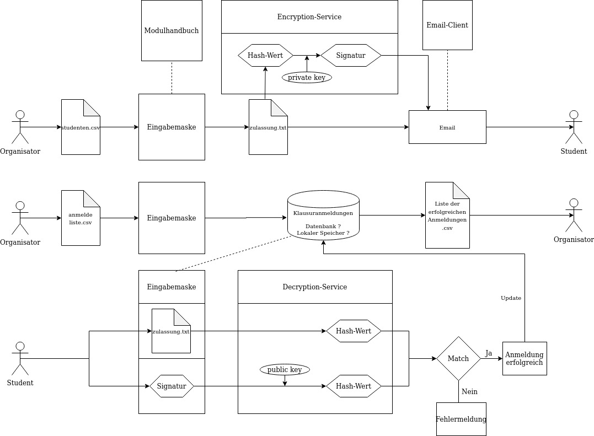

[[section-runtime-view]]
== Laufzeitsicht

=== Anmeldeliste Hochladen
* Diese Ansicht ist nur für Organisatoren zugänglich.
* Der Organisator kann hier eine CSV Datei hochladen die eine Liste mit allen Studenten enthält die in einem Modul zur Prüfung angemeldet sind. Damit der Upload funktioniert muss diese Datei genau diese Spalten in dieser Reihenfolge enthalten:
** matriculationnumber,email,forename,name
** Eine Beispieldatei wurde hier abgelegt: /dokumentation/images/Liste_Beispiel.csv
* Vor dem Hochladen muss das Fach sowie die Abgabefrist für das Nachreichen einer Klausurzulassung gesetzt werden.
* Während des Hochladens wird überprüft für welche Studenten aus der Datei eine gültige Quittung im MinIO storage service exisitert.
* Auf dem Bildschirm werden zwei Listen angezeigt: zugelassene Studenten (Quittung wurde gefunden) und nicht zugelassene Studenten (es wurde keine Quittung gefunden).
* Weiterhin kann eine Warnungsnachricht an individuelle Studenten oder an alle gesendet werden, dass eine gültige Quittung nachgereicht werden muss (siehe unten, Quittungen validieren).

=== Zulassungsliste hochladen
* Diese Ansicht ist nur für Organisatoren zugänglich.
* Der Organisator kann hier eine CSV Datei hochladen die alle Studenten enthält welche eine Klausurzulassung erworben haben. Die Restriktionen für diese Datei sind die gleichen wie für die Anmeldeliste es kann also die gleiche Beispieldatei verwendet werden.
* Vor dem Hochladen muss das Fach und das Semester in dem die Zulassung erworben wurde angegeben werden.
* Nach dem Hochladen wird die Liste auf dem Bildschirm angezeigt.
* Nun kann den Studenten jeweils einzeln oder an alle Studenten gleichzeitig eine Email mit dem Zulassungsnachweis (Quittung) als Anhang gesendet werden.
* Gleichzeitig mit dem Senden werden die Quittungen im MinIO storage service gespeichert.

=== Quittungen validieren
* Diese Ansicht ist für Organisatoren und Studenten zugänglich.
* Hier kann vom Organisator oder Studenten eine Quittung hochgeladen werden. Diese Quittung wird vom System überprüft und es wird auf dem Bildschirm angezeigt ob der die Quittung gültig ist.
* Eine gültige Quittung bedeutet, dass der Student für dieses Fach eine gültige Klausurzulassung erworben hat.
** Eine Beispieldatei wurde hier abgelegt: /dokumentation/images/codetoken_Analysis_Duck.txt

=== Laufzeitdiagramm

